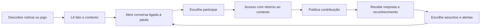

# Auditoria UI/UX — Orange Brick

Data: 29/09/2026. Método: duas avaliações independentes — A `/root/design_review`, B `/root/technical_evidence` — seguidas de validação e síntese. Escopo: portal, notícias, Brickboard, perfis, calendário, gamificação, descoberta, acesso e retenção.

## Diagnóstico e notas

O Orange Brick tem identidade visual reconhecível e uma base funcional relevante. Sua competitividade hoje é limitada pela confiabilidade dos dados, pela recuperação de erros e pela dificuldade de transformar leitura em uma conversa recorrente. Uma interface visualmente forte perde credibilidade quando apresenta vazamentos como informação confirmada, uma notícia de agosto como matéria do dia ou um perfil com nove publicações e histórico vazio.

As notas abaixo são julgamentos de especialistas sobre o estado observado. Não representam taxas de conversão, retenção ou resultados de pesquisa com usuários.

| Área | Nota /10 | Principal fundamento |
|---|---:|---|
| UI | 6 | Marca forte; composição e componentes ainda inconsistentes |
| UX | 4 | Erros silenciosos, caminhos incompletos e controles ineficazes |
| Acessibilidade | 5 | Bons fundamentos, com falhas A/AA verificadas |
| Mobile | 5 | Funciona nas larguras comuns; perde navegação e escala em 320 px |
| Comunidade | 3 | Recursos existem; atividade observada antiga e participação pouco descoberta |
| Retenção | 3 | Personalização indisponível no banco consultado e promessas sem comprovação operacional |
| Engajamento | 3 | Chamadas e recompensas existem; contexto de participação pouco convincente |
| Conversão | 4 | Acesso contextual presente; disponibilidade e mensagens inconsistentes |
| **Geral** | **4,1** | Média simples das oito dimensões |

Avaliação técnica: acessibilidade 2/4; desempenho 2/4; responsividade 2/4; tematização 2/4; integridade de implementação 2/4. **10/20: exige trabalho significativo.** Desempenho é provisório: não foram medidos Core Web Vitals em produção, consumo em aparelho físico ou rede móvel limitada.

## Evidências e limites

- Inspeção do checkout local servido em `http://localhost:3100`, com dados reais. A interface local contém alterações que não foram demonstradas como equivalentes ao deployment.
- Avaliação A visual de home, artigo, Brickboard, perfil oficial, calendário, ranking, conquistas, ajuda e modal de acesso em desktop e celular.
- Avaliação B: 40 combinações de dez rotas e quatro larguras — 320, 390, 768 e 1280 px — em Chromium. `/entrar` e `/cadastro` redirecionaram à home por configuração; não contam como formulários de credenciais exercitados.
- Nenhum overflow horizontal do documento nessas 40 observações. Faixas de filtros com scroll local continuam precisando de descoberta e operação acessíveis.
- Axe: sete regras distintas, 16 elementos distintos afetados nos estados examinados. Ocorrências repetidas em diferentes larguras não foram contadas como problemas independentes.
- Detector da skill: um achado advisory, `design-system-font-size`, em `src/components/ui/gradient-button-group.tsx:35`, valor `0.62rem`.
- Consulta somente de leitura ao banco: última publicação em 26/08/2026; 14 posts comunitários, nove oficiais e cinco não oficiais; último post comunitário também em 26/08. Isso não prova quantos membros estão ativos hoje nem a origem humana de cada conta.
- `user_follows` e `notification_preferences` retornaram `PGRST205`, ausentes do schema cache. A consulta do histórico de perfil retornou erro porque `community_posts.image_url` não existe.
- O domínio público falhou com `ERR_CONNECTION_RESET` neste ambiente. O HTML do deployment foi obtido pelo Vercel CLI, mas isso não comprova seu estado visual após hidratação.
- Não foram realizados cadastros, logins, votos, publicações, envios de newsletter ou alterações remotas. Fluxos autenticados e entrega de notificações precisam de validação própria.
- Não houve teste com leitor de tela real ou aparelhos físicos Android/iPhone. Conformidade WCAG integral não pode ser certificada por axe e inspeção de código.
- Complemento WebKit: o navegador foi baixado, mas a execução falhou por dependência ausente `harfbuzz-icu.dll`. Não houve validação em Safari/WebKit; o perfil iPhone não foi tratado como aprovado.
- Capturas com grandes áreas vazias por `content-visibility` e imagens ainda não carregadas foram excluídas como prova de defeito de layout ou ausência de imagens.

## 1. Primeira impressão

| Critério solicitado | Nota /10 |
|---|---:|
| Visual | 7 |
| Clareza | 6 |
| Credibilidade | 3 |
| Modernidade | 6 |

O usuário identifica rapidamente um portal gamer: logo, manchetes e imagens comunicam o assunto. A aparência profissional é parcial: o sistema visual tem personalidade, mas dados contraditórios prejudicam confiança. A proposta de rede social é menos evidente; a home concentra notícias e apresenta a comunidade depois do Radar.

Nos primeiros cinco segundos, três destaques de GTA VI reduzem amplitude editorial. No mobile, consentimento cobre parte do conteúdo; no Brickboard, uma enquete longa ocupa o espaço em que o visitante deveria encontrar uma conversa. A poluição principal vem de chamadas concorrentes, termos ambíguos e sobreposição de controles.

**Melhoria:** uma manchete completa, duas pautas de assuntos diferentes, data de atualização verdadeira e uma conversa editorial contextual. Usar “Destaque” quando a matéria não for do dia.

## 2. Identidade visual

### Paleta

A combinação de `#0D0E12`, `#1C1E24` e `#FF5E00` é reconhecível e coerente. Categorias devem manter suas cores como apoio a rótulos textuais. Não há evidência de que adicionar novas cores melhore a experiência.

Preto sobre laranja tem contraste aproximado de 6,85:1; branco sobre o mesmo laranja, 3,06:1. O CSS atual já substitui branco por preto em várias combinações de classes, portanto a simples presença de `text-white` no JSX foi descartada como prova de falha. O defeito real está no indicador que marca Início quando nenhuma rota está ativa: texto cinza sobre laranja tem aproximadamente 1,2:1.

**Melhoria:** tokens únicos para texto sobre ação, estados selecionados, superfície, borda, foco e texto secundário; selecionar o item correto e deixar o indicador ausente quando não houver correspondência. Alto contraste deve cobrir também cores literais.

### Tipografia

Outfit dá força às manchetes. A truncagem de duas linhas na manchete principal oculta informação. Labels da navegação mobile usam aproximadamente 9,9 px. Corpo, cards e comentários alternam famílias e tamanhos; o leitor A+ da matéria não muda os parágrafos.

**Melhoria:** título principal completo; labels de navegação com pelo menos 12 px como meta de design; corpo confortável de 16–18 px, altura de linha de 1,6–1,75, largura aproximadamente 60–75 caracteres; escala de leitura realmente aplicada a parágrafos, listas e subtítulos. Esses valores são recomendações de leitura, não limiares automáticos de conformidade WCAG.

## 3. Portal de notícias

### Homepage

A manchete principal tem destaque adequado no desktop, mas as três posições superiores repetem o assunto. A home limita a seleção a cinco notícias; depois de três destaques, sobram duas em “Últimas”. “Mais hypadas” mistura leitura com hype e exclui os três destaques. Reviews têm filtro, mas pouca presença editorial própria.

**Melhoria:** curadoria por relevância, atualidade e diversidade de assunto; módulo de últimas com quantidade suficiente para exploração; seleção de review quando houver análise publicada; ranking com janela temporal e regra claramente explicada.

### Matéria

Há resumo, autoria, data, tempo de leitura, favoritos, reações, relacionadas, notas da comunidade e convite para debate. Esses fundamentos devem ser preservados. O caso observado contradiz seu próprio selo de confirmação. Data exata e relativa repetem informação. Fonte aparece antes do desenvolvimento e a área final concentra várias chamadas sociais.

A amostra tem **dois blocos de imagem com URLs distintas e diferentes da capa**, confirmado no banco. Não foi aceita a hipótese de imagem faltante baseada apenas na captura longa. Isso não valida autenticidade, resolução e pertinência de todo o acervo.

**Melhoria:** distinguir confirmado, rumor e desenvolvimento no dado editorial; fonte e contexto de apuração ao final; uma entrada primária para a discussão. Para imagens, priorizar screenshot, arte e trailer oficiais relacionados ao fato; complementar a capa com cenas específicas, legendas, créditos e alt text verificáveis. A auditoria integral das imagens históricas permanece uma tarefa própria. Vídeos já têm suporte a título, carregamento tardio e `youtube-nocookie.com`; a presença de trailers depende da pauta e de sua apuração.

## 4. Rede social gamer

O feed dispõe de Recentes, Seguindo, Mais debatidas, plataformas, reações, comentários e republicação. A continuidade de consumo é prejudicada pela atividade antiga observada e pela predominância editorial. Não há dados de sessão para afirmar vontade real de continuar rolando.

No mobile, enquete e cabeçalho antecedem o feed. A busca específica de conversas é escondida; existe busca universal em `/busca`, incluindo Brickboard e perfis. O problema é o custo de chegar até ela e a falta de contexto local.

O compositor suporta texto curto, imagem e matéria anexada. O fluxo observado não demonstra criação de vídeo ou enquete pelo visitante. Comentários possuem respostas e curtidas; o modelo visual concentra respostas em um nível. Discussões na matéria e no Brickboard podem competir pela mesma conversa.

**Melhoria:** feed primeiro, compositor único, enquete compacta e contextual, filtros persistidos na URL, estado vazio com limpar filtros, conversa vinculada à matéria e resposta com contexto do destinatário. Validar novos formatos de postagem pela demanda da comunidade antes de ampliá-los.

## 5. Perfis

Avatar, identidade, interesses, histórico, conquistas, contribuição e botão seguir existem. A conta oficial mostra nove Bricks e histórico vazio: a consulta usa uma coluna inexistente e ignora o erro. Esse defeito afeta credibilidade e identidade.

Há limite de vinte publicações sem paginação. Conta oficial é chamada de leitor. Bio ausente é repetida. Barras de contribuição comparam unidades diferentes e podem sugerir uma meta que não existe.

**Melhoria:** histórico coerente com contadores, erro e retry próprios, identidade editorial diferenciada, conquistas selecionadas com significado, paginação e atividades verificáveis. Oferecer participação a partir de interesses e conversas compartilhados.

## 6. Gamificação

| Sistema | Estado encontrado |
|---|---|
| Pontuação / XP | Implementação e regras públicas presentes |
| Níveis | Progressão vitalícia presente |
| Badges / conquistas | Catálogo, raridades e vitrine presentes |
| Ranking | Temporada e critérios de elegibilidade presentes |
| Reputação | Contribuições e interações geram XP; não foi comprovada uma reputação independente de volume |
| Temporadas | Modelo e tela presentes; prazo pouco explícito ao usuário |

Há limites diários, exclusão de interações próprias e previsão de revogação no sistema. Isso é um fundamento positivo; não foi validada toda execução de suas regras em produção.

**Melhoria:** explicar próximo passo e critérios de entrada; mostrar início e fim da temporada; apresentar conquistas bloqueadas como critérios exploráveis; impedir troca silenciosa da quarta conquista. Reconhecer contribuição útil, respostas com fonte e acolhimento de novos membros. Validar hipótese de spam por recompensa de volume com taxa de remoção, denúncias e avaliações de utilidade.

## 7. UX de comunidade

Filtros por plataformas e temas oferecem organização, mas não foi observado um fluxo completo de grupos com propósito, responsável e rotina. A sensação de pertencimento depende de receber resposta e reconhecer pessoas; a existência de XP e posts oficiais não demonstra essa dinâmica.

**Melhoria:** começar com poucos espaços por interesse com atividade real; pergunta editorial específica; boas-vindas curtas; moderadores identificáveis; orientação de participação; retorno ao debate depois do acesso. Medir tempo até primeira resposta e proporção de conversas sem resposta. Ampliar grupos conforme a demanda.

## 8. Descoberta de conteúdo

Relacionadas, plataformas, Radar, busca universal e Em alta existem. Relacionadas usam categoria como principal associação, sem demonstrar ligação específica com jogo, empresa ou assunto. A busca da home filtra o lote carregado; a universal limita cada grupo e não distingue erro de zero resultados. Há links para o Radar com fragmento incompatível com os IDs reais.

**Melhoria:** relacionar por entidade editorial e assunto, exibir contagem completa com paginação e erro separado, oferecer chips contextuais, mostrar próximo conteúdo pertinente e preservar filtro/posição ao voltar. Descrever cada ranking: mais lidas, jogos mais aguardados ou ranking da comunidade.

## 9. Mobile first

Em 390 e 768 px os layouts se adaptam, com navegação inferior e controles rotulados. Em 320 px, regras de modo watch escondem a navegação e forçam fonte de 14 px, desconsiderando a preferência de aumento. O calendário exige comparação por uma página longa de cards; scroll automático pode levar o visitante para longe dos filtros.

**Melhoria:** suportar 320 px como smartphone/zoom, manter navegação e escala, organizar calendário em lista semanal compacta, tornar votação expansível e usar ação explícita “Ir para esta semana”. Definir posições de controles flutuantes em função de banners e safe areas. Validar teclado virtual, orientação e instalação/push em aparelho físico.

## 10. Acessibilidade WCAG 2.2

| Critério | Achado verificável |
|---|---|
| 1.3.1 — informações e relações | Estrutura inválida de `dl`, `dt` e `dd` no perfil |
| 1.4.1 — uso de cor | Links legais do modal sem distinção persistente além da cor |
| 1.4.3 — contraste mínimo | Indicador incorreto de Início deixa texto cinza sobre laranja |
| 2.5.8 — tamanho mínimo do alvo | Limpar busca do calendário: 16 × 44 px e sobreposição com input |
| 4.1.2 — nome, função e valor | Botão de limpar sem nome; `aria-label` proibido em elemento genérico; estado de alguns filtros ausente |
| 2.4.3 / 2.4.7 — foco | Slides invisíveis continuam recebendo foco no carrossel |
| 1.4.4 / 1.4.10 — ampliar texto e reflow | A+ ineficaz; escala e navegação prejudicadas em 320 px, exigindo verificação de regressão específica |

O produto **não pode ser classificado como conforme a WCAG 2.2 AA** no estado examinado. Axe não valida todas as exigências nem substitui leitor de tela.

Há resultados positivos: skip link, foco global, labels em muitos controles, estados nas reações e filtros comunitários; modal de acesso mantém foco, fecha com Escape e restaura o disparador. Não há necessidade de converter todo filtro em tab: botões com `aria-pressed` são adequados quando representam seleção.

A WCAG AA exige alvo mínimo de 24 × 24 CSS px, com exceções de espaçamento e equivalência. **44 × 44 px é a meta prática de toque adotada aqui**, não um diagnóstico automático de falha AA para qualquer elemento menor. Referência: [WCAG 2.2](https://www.w3.org/TR/WCAG22/).

## 11. Psicologia da interface

**Carga cognitiva:** seis destinos mobile, sete categorias e seis plataformas não são falhas por quantidade isolada. A combinação de abreviações, taxonomias variáveis e comandos redundantes aumenta o custo de decisão. Usar divulgação progressiva, nomes claros e um CTA primário por intenção.

**Progresso:** apresentar ganhos e próxima contribuição útil, critérios exploráveis e marcos pequenos. A existência do toast de XP não prova que o usuário percebe valor.

**Atualidade e retorno:** usar novidades reais desde a última visita, agendas confiáveis e respostas recebidas. Há componente “Desde sua última visita”; sua posição tardia reduz a força do retorno.

**Participação:** formular perguntas que pedem experiência ou decisão concreta. Para uma notícia de mecânicas de jogo, um exemplo de pergunta de design é “Qual mudança afetaria mais sua maneira de jogar?”. Isso é exemplo de copy, não dado ou enquete publicada.

**Jornada emocional:** curiosidade pela manchete → dúvida com selo contraditório → frustração com login/erro silencioso → conclusão com várias ações concorrentes. Recuperação clara, contexto preservado e resposta humana são as prioridades para mudar essa jornada. Resultados de retenção precisam de teste com usuários e métricas.

## 12. Heurísticas de Nielsen

Escala independente da avaliação A: 0–4, convertida linearmente para a escala solicitada de 0–10.

| Heurística | Nota /10 | Problema principal |
|---|---:|---|
| Visibilidade do estado | 5 | Falha de dados pode parecer ausência de atividade |
| Correspondência com mundo real | 5 | Brick, Radar e hype têm significados pouco claros |
| Controle e liberdade | 5 | Filtros e recuperação não são preservados consistentemente |
| Consistência e padrões | 2,5 | Navegação, taxonomia e disponibilidade variam |
| Prevenção de erros | 5 | Validações existem, mas vitrine pode trocar seleção silenciosamente |
| Reconhecimento em vez de memória | 5 | Recursos comunitários e busca local pouco descobríveis |
| Flexibilidade e eficiência | 5 | Atalhos presentes; calendário e histórico custosos |
| Estética e minimalismo | 5 | Chamadas concorrentes e enquete extensa |
| Reconhecer, diagnosticar e recuperar erros | 2,5 | Erros ignorados no perfil e ranking |
| Ajuda e documentação | 5 | Guia existente, com fraca descoberta contextual |
| **Total** | **45/100** | Equivalente a 18/40; média 4,5/10 |

Personas de verificação: visitante novo precisa compreender o valor comunitário; leitor crítico exige coerência entre selo e conteúdo; usuário mobile precisa comparar/participar com poucos passos; pessoa de baixa visão precisa de escala e foco confiáveis; membro recorrente precisa de histórico e progressão verificáveis.

## 13. Benchmarking funcional

Comparação de recursos documentados publicamente. Não é um teste lado a lado de performance, acessibilidade ou conversão dos concorrentes; algumas páginas bloquearam acesso direto, com consulta ao índice de busca.

| Referência | Recurso observado/documentado | Oportunidade no Orange Brick | Vantagem a preservar |
|---|---|---|---|
| [IGN Playlist](https://ign-product.squarespace.com/tour) | Biblioteca, listas, estados de jogo e perfis | Acompanhar jogos e séries editoriais; conectar interesse a notícia, lançamento e discussão | Foco editorial enxuto em português |
| [GameSpot](https://www.gamespot.com/) | Notícias, reviews, vídeos e agenda em módulos próprios | Dar presença reconhecível a reviews e autoria; variedade nas chamadas | Identidade compacta e distintiva |
| [Reddit](https://support.reddithelp.com/hc/en-us/articles/25564722077588-Community-Achievements) | Conquistas comunitárias, contribuição e reconhecimento local | Reputação por utilidade e espaço de interesse; contexto de resposta | Ligação direta entre redação e conversa |
| [Discord](https://support.discord.com/hc/en-us/articles/11074987197975-Community-Onboarding-FAQ) | Onboarding por interesse e escolha de canais | Entrada curta por plataforma/assunto e primeiro passo claro | Conteúdo editorial público e pesquisável |
| [Steam Community](https://steamcommunity.com/) | Hubs de jogos, screenshots, vídeos, guias e reviews | Organizar comunidade por jogo; galeria contextual e material oficial | Apuração de indústria além de um ecossistema |
| [ResetEra](https://www.resetera.com/forums/-/latest-threads) | Tópicos persistentes, última resposta e discussões por espaço | Continuidade das conversas, último contexto e navegação para novas respostas | Leitura editorial com resumo antes do debate |

As vantagens indicadas são oportunidades de posicionamento e características locais; não provam superioridade de usabilidade perante os concorrentes. O caminho competitivo prioritário é cumprir a promessa de informação confiável e conversa útil com público específico.

## 14. Design system

| Componente | Inconsistência / ação |
|---|---|
| Botões | Unificar tamanhos, estados, nomes e contraste; manter ação selecionada semanticamente |
| Cards | Definir diferença entre editorial, conversa e lançamento; controlar truncagem e carregamento |
| Inputs | Label persistente, limpar com nome/alvo adequado, estados de erro próximos |
| Menus | Cabeçalho e destinos estáveis; labels compreensíveis e rota ativa correta |
| Modais | Reutilizar comportamento de foco verificado; feedback de envio e retorno ao contexto |
| Tabs / filtros | Estados acessíveis, URL quando necessário e recuperação de seleção vazia |
| Badges | Separar categoria, status de apuração, autoria oficial e conquista |
| Tags | Vocabulário único para plataforma/assunto; evitar um nome com duas funções |

O sistema precisa de contrato de comportamento para cada componente, além dos tokens visuais. Priorizar exemplos de carregamento, vazio, erro, pendência e sucesso. Alto contraste e movimento reduzido devem cobrir componentes com estilos literais/inline.

## 15. Conversão e retenção

A principal conversão deve ser definida como primeira participação útil: resposta, comentário ou seguir um interesse, além da criação da conta. A conta por e-mail tem código implementado, mas está desativada no runtime; o modal ainda promete essa alternativa. Login Google não expõe tratamento adequado do erro retornado em seu contexto.

As preferências de notificação têm tabela indisponível no banco consultado. A UI oferece resumo semanal e assuntos seguidos; foi encontrada gravação de preferência, mas não evidência de execução de entrega para essas duas opções nos caminhos pesquisados. Newsletter aparece em Contato, com endpoint de cadastro; não foi encontrado pipeline de envio no repositório. Um serviço externo pode existir e precisa ser comprovado antes de prometer a entrega.

Favoritos são salvos localmente, sem sincronização de conta. Progresso de leitura é armazenado, sem descoberta clara de retomada nas superfícies examinadas. Push tem implementação e orientação de instalação para iPhone; entrega efetiva e permissões reais não foram exercitadas.

**Melhoria:** acesso com benefício contextual e retorno à ação; interesses após primeira participação; notificações por assunto, resposta e frequência escolhida; newsletter somente com operação confirmada; favoritos/retomada com limite do dispositivo explícito. Mostrar cadastro de newsletter em momentos pertinentes de leitura.

Métricas propostas, sem baseline inventado: primeira participação por visitante, conclusão de cadastro, tempo até primeira resposta, conversas sem resposta, retorno D1/D7/D30 por coorte, segunda matéria na sessão, taxa de cancelamento de alertas, remoções/denúncias por contribuição e frequência de erro por fluxo. Separar visitante, conta nova, conta recorrente e moderação.

## Top 50 problemas ordenados por impacto

Legenda: **V** = verificado visualmente/por interação; **D** = consulta real de dados; **C** = caminho confirmado no código, sem execução autenticada ou condição de volume. P1 = problema importante, inclusive falha A/AA; P2 = atrito ou inconsistência com alternativa. Nenhum P0 global foi demonstrado. Totais desta seleção: 19 P1, 31 P2. Achados repetidos entre avaliações foram consolidados.

| # | P | Evidência | Problema → solução prática |
|---|---|---|---|
| 1 | P1 | D/V | Última notícia e último post comunitário de 26/08 → restabelecer cadência e alertar ausência de atualização |
| 2 | P1 | D/V | Vazamentos com selo confirmado, contradizendo o texto → corrigir status editorial e exigir escolha explícita |
| 3 | P1 | C/V | Calendário fixa ano 2026 para datas de 2027 → derivar agrupamento da data ISO |
| 4 | P1 | D/C | Tabela de seguir assuntos/perfis indisponível → reconciliar schema e verificar persistência |
| 5 | P1 | C | Seguir muda visual sem checar erro ou desfazer falha → aguardar confirmação, informar erro e fazer rollback |
| 6 | P1 | D/C | Preferências de notificação usam tabela indisponível → reconciliar schema e distinguir carregar, falhar e salvar |
| 7 | P1 | D/V | Perfil com nove Bricks mostra histórico vazio por consulta inválida → campos corretos, erro explícito e retry |
| 8 | P1 | V | Navegação principal desaparece em 320 px → preservar menu compacto nessa largura |
| 9 | P1 | V | Fonte forçada de 14 px em 320 ignora escala salva → preservar aumento e reflow |
| 10 | P1 | V | A+ da matéria mantém parágrafos em 16 px → aplicar escala efetiva aos elementos de leitura |
| 11 | P1 | V/C | Slides invisíveis recebem foco no Radar → controlar foco/visibilidade e navegação do carrossel |
| 12 | P1 | V | Limpar busca no calendário não possui nome acessível → label “Limpar busca” |
| 13 | P1 | V | Mesmo botão tem alvo 16 × 44 px sobreposto ao input → ampliar alvo e reservar espaço |
| 14 | P1 | V | Links legais no modal distinguem-se apenas por cor → sublinhado persistente |
| 15 | P1 | V | Estrutura semântica inválida da lista de dados do perfil → agrupamento correto de dt/dd |
| 16 | P1 | V | Início é realçado sem rota ativa, gerando contraste ruim → indicador apenas para correspondência real |
| 17 | P1 | V/C | Filtro Xbox busca xsx e exclui XBOX SERIES → normalizar identificador e separar label |
| 18 | P1 | C | Paginação interrompe antes da última página → comparar página carregada com total corretamente |
| 19 | P1 | C | Filtro vazio da home orienta limpar sem callback → conectar ação de recuperação |
| 20 | P2 | C | Caminho SSR do Radar não aplica retenção mensal do caminho cliente; condição de mês anterior não reproduzida → regra compartilhada em todos os carregamentos |
| 21 | P2 | V | Três destaques de GTA VI repetem pauta → curadoria de diversidade |
| 22 | P2 | V/C | Título principal cortado em duas linhas → reservar espaço para manchete completa |
| 23 | P2 | V/C | Comunidade aparece depois do Radar na home → antecipar conversa contextual com atividade verdadeira |
| 24 | P2 | V | Enquete extensa domina o primeiro viewport comunitário → feed primeiro e enquete compacta |
| 25 | P2 | V/C | “Voto anônimo” exige conta sem explicar anonimato → esclarecer identidade e visibilidade do voto |
| 26 | P2 | V | Pergunta genérica de mercado para pauta de mecânicas → pergunta ligada à experiência específica |
| 27 | P2 | V | Comentários, notas, republicação e Brickboard concorrem no final → CTA primário de debate, notas separadas |
| 28 | P2 | V/C | Modal promete conta por e-mail desativada → copy compatível com disponibilidade; rota com explicação |
| 29 | P2 | C | Erro OAuth retornado sem feedback contextual → pendência, erro acionável e tentativa novamente |
| 30 | P2 | C | Ranking ignora erro RPC e mostra vazio → diferenciar falha de ausência de classificados |
| 31 | P2 | C | Busca universal trata erro de consulta como zero → erro por grupo e retry |
| 32 | P2 | C | Busca/filtros da home operam sobre lote carregado → consulta completa com paginação e contagem confiável |
| 33 | P2 | C | Perfil limita histórico a vinte posts → paginação acessível |
| 34 | P2 | V | Temporada sem início/fim e ranking sem CTA de entrada → prazo, requisitos e ação correspondente |
| 35 | P2 | V | Visitante vê conquistas pessoais em 0% → separar catálogo de progresso e explicar acesso |
| 36 | P2 | C | Conquistas bloqueadas são botões sem foco → critérios exploráveis por teclado |
| 37 | P2 | C | Quarta conquista remove primeira silenciosamente → limite explícito e seleção consciente |
| 38 | P2 | V/C | Busca específica de conversas escondida no mobile → controle local ou entrada universal contextual |
| 39 | P2 | C | Aba/plataforma comunitária não preservadas na URL → filtros compartilháveis e restauração ao voltar |
| 40 | P2 | C | Busca vazia incentiva criar em vez de limpar → recuperação de filtro e sugestões pertinentes |
| 41 | P2 | V/C | Navegação mobile com labels de aproximadamente 9,9 px → reduzir destinos e ampliar labels |
| 42 | P2 | C | Seleção de filtros do calendário/mês comunicada apenas pelo estilo → estado acessível e grupo nomeado |
| 43 | P2 | V | Painel de acessibilidade não fecha com Escape → fechar e retornar foco ao disparador |
| 44 | P2 | V | Consentimento intercepta botão de acessibilidade → posição coordenada com banner |
| 45 | P2 | C | Links de busca/votação usam fragmento incompatível no Radar → IDs consistentes e navegação respeitando hash |
| 46 | P2 | V/C | Radar faz scroll automático para longe dos filtros → ação explícita para data atual |
| 47 | P2 | C | Feed comunitário lê posts, reações e comentários sem limites → paginação no servidor e agregados por lote |
| 48 | P2 | C | Calendário/carrossel carregam imagens de itens invisíveis → lazy loading, tamanhos e renderização próxima |
| 49 | P2 | C | Transição inline do carrossel escapa de movimento reduzido → alternativa específica de movimento |
| 50 | P2 | V/C | Headers e taxonomia variam entre portal, artigo e comunidade → mapa estável e vocabulário único |

### Fontes de localização do backlog

- 1, 4, 6, 7: `tmp/ui-audit/public-state.json`, `article-check.json` e `src/lib/hooks/useFollowPreferences.ts:20`.
- 2, 10, 27: `src/app/posts/[slug]/PostDetailClient.tsx:416`, `:478`, `:539`; `src/lib/markdown.tsx:143`.
- 3, 12, 13, 17, 20, 42, 46, 48: `src/app/lancamentos/ReleasesPageClient.tsx:94`, `:182`, `:188`, `:291`, `:327`, `:400`, `:408`, `:428`, `:541`; `src/app/lancamentos/page.tsx:24`.
- 5: `src/lib/hooks/useFollowPreferences.ts:28`; 7, 15, 33: `src/app/profile/[nickname]/page.tsx:157`, `:163`, `:459`.
- 8, 9: `src/app/globals.css:234`; 11, 48, 49: `src/components/originkit/ui/coverflowgallery-custom-style.tsx:170`, `:198`, `:203`.
- 14, 28: `src/components/auth/AuthModal.tsx:94`, `:135`, `:155`; `src/proxy.ts:46`; 29: `src/lib/contexts/AuthContext.tsx:83`.
- 16, 41: `src/components/ui/gradient-button-group.tsx:20`, `:35`; 18: `src/components/feed/NewsList.tsx:35`.
- 19, 21, 22, 32: `src/components/feed/HomePageClient.tsx:44`; `src/components/feed/NewsFeed.tsx:106`, `:154`, `:193`, `:204`; 23: `HomePageClient.tsx:55`.
- 24–26, 38–40: `src/app/brickboard/page.tsx:50`, `:63`, `:88`, `:234`, `:444`, `:527`; `src/components/community/GamerPollWidget.tsx:73`.
- 30, 34: `src/app/brickboard/ranking/page.tsx:20`, `:39`, `:126`; 31, 45: `src/app/busca/page.tsx:28`, `:48`; `src/components/releases/ArticleHypeSummary.tsx:70`; calendário `:535`.
- 35–37: `src/app/brickboard/conquistas/page.tsx:60`, `:119`, `:174`.
- 43: `src/components/ui/AccessibilityMenu.tsx:39`; 44: `src/components/ui/CookieConsent.tsx:35`; 47: `src/lib/hooks/useCommunityFeed.ts:59`.
- 50: `SiteHeader.tsx`, headers de artigo, Brickboard, ranking e perfil; `CATEGORY_CONFIG` e labels das relacionadas.

## Quick wins

1. Corrigir status do artigo e trocar “Matéria do dia” por rótulo condicional à data.
2. Corrigir query do perfil e renderizar erro/retry.
3. Corrigir ano/IDs de plataforma do Radar e fragmentos de links.
4. Nome e alvo do botão de limpar; links legais sublinhados; semântica do perfil.
5. Restaurar navegação/escala em 320 px e corrigir A+.
6. Conectar limpar filtros; ocultar indicador de item inexistente.
7. Reduzir enquete mobile e trazer feed para cima.
8. Corrigir mensagens de acesso conforme flags e preservar contexto.

São alterações localizadas; precisam de regressão em desktop/mobile, teclado e estados de erro antes de publicação.

## Melhorias estratégicas — impacto alto, esforço médio

- Contrato único de dados entre feed, perfil, calendário e contadores.
- Navegação editorial/comunitária estável e busca contextual.
- Uma conversa persistente por pauta, com contexto e novas respostas.
- Onboarding curto por interesses após primeira participação.
- Gamificação por contribuição útil, prazo e próximos passos transparentes.
- Operação comprovada de newsletter/digest e preferências efetivamente respeitadas.
- Hubs de jogos e assuntos ligando notícia, lançamento, vídeo e conversa.

## Roadmap

| Prazo | Entrega | Critério de aceite |
|---|---|---|
| 7 dias | Credibilidade, schema essencial, perfil, calendário, acesso e falhas A/AA | Datas/selo coerentes; seguir/preferências persistem; perfil lista atividade correta; teclado e 320 px funcionam |
| 30 dias | Navegação unificada, feed primeiro, conversa editorial, busca e histórico paginados | Leitor encontra notícia e discussão; erros são recuperáveis; filtros/posição/contexto são preservados |
| 60 dias | Entrada por interesses, conquistas contextualizadas, hubs e rotina de comunidade | Primeira resposta, retorno por coorte e qualidade da contribuição medidos; alertas configuráveis entregues |
| 90 dias | Otimização de leitura/descoberta, newsletter comprovada, escala e refinamento visual | Comparação com baseline real; testes com usuários; regressão cross-browser e leitores de tela; revisão dos recursos sem uso |

Estimativa de sequência, não compromisso de calendário ou ganho percentual. Dependências: reconciliação do banco, configuração de autenticação, operação editorial, moderação e disponibilidade de ambiente autenticado de teste.

## Redesign recomendado e exemplos visuais

É necessário reorganizar home, Brickboard e calendário, consolidando componentes e dados. A identidade de tijolo, escuro e laranja pode sustentar essa reorganização.

### Home desktop — wireframe de direção

```text
ORANGE BRICK   Notícias   Comunidade   Lançamentos   Buscar   Entrar
──────────────────────────────────────────────────────────────────
Atualizado em [data real da publicação mais recente]
[MANCHETE COMPLETA + CAPA OFICIAL]  [Pauta de outro assunto]
[resumo + autoria + status]       [Review ou terceira pauta]
──────────────────────────────────────────────────────────────────
ÚLTIMAS NOTÍCIAS                  CONVERSA EM DESTAQUE
[fatos variados, com datas]       [pergunta específica + respostas]
[ver arquivo completo]           [participar]
──────────────────────────────────────────────────────────────────
SAEM ESTA SEMANA                  SEUS ASSUNTOS / NOVIDADES
[lista por data e plataforma]     [apenas quando há preferência]
```

### Comunidade mobile — wireframe de direção

```text
Comunidade                 Buscar
[Recentes] [Seguindo] [Debates]
[Plataforma ▼] [Limpar filtros]
[Compartilhe uma pergunta ou experiência]
──────────────────────────────────
[Pessoa · assunto · data]
[Texto / imagem contextual]
[Responder] [Reagir] [Compartilhar]
──────────────────────────────────
[Pergunta do dia compacta ▼]
──────────────────────────────────
Notícias | Comunidade | Radar | Conta
```

Quatro destinos são uma proposta a validar, não um novo requisito implementado. Busca permanece disponível no topo; ranking/conquistas entram como recursos de comunidade/conta. A seleção e os rótulos precisam passar por teste de compreensão.

### Fluxo de participação



Notificação deve conduzir à resposta ou ao contexto original. Perfil deve mostrar a trajetória com dados confiáveis. Calendário deve priorizar comparação semanal, com votação complementar e ano correto.

## O que preservar

- Marca e linguagem editorial próprias.
- Suporte a fontes, status de apuração e contexto colaborativo.
- Relacionadas, favoritos, vídeos acessíveis e convites de participação existentes.
- Fundamentos de foco/labels e comportamento correto do modal de acesso.
- Progressão vitalícia separada de temporadas e regras públicas de limites.

## Perguntas estratégicas já convertidas em decisões de auditoria

A primeira tarefa recomendada é devolver confiabilidade a dados e ações, depois reduzir o esforço para participar e voltar. A identidade visual existente serve como base. A proposta de comunidade deve ser validada com pessoas do público e atividade real. Nenhuma taxa de crescimento, conversão ou benefício comportamental foi presumida.

Questions skipped: o usuário já definiu escopo completo, áreas, entregáveis e autorizou as avaliações independentes; o roadmap registra as prioridades técnicas e de produto.

## Execução das melhorias

### Continuação: busca, navegação e comunidade

### Continuação: histórico, manchetes e datas

### Banco remoto: assuntos e preferências

### Continuação: alertas e transferência de dados

### Paginação da comunidade

Migração versionada `20260929000004_community_feed_page.sql` acrescenta ao banco a coluna pública de nome de usuário, preenche os registros existentes pelo perfil e define função de feed com lotes de 20 posts, busca, plataforma, artigo, tema, permalink, ordem por atividade, reações e contagem de comentários/compartilhamentos. A busca de quem o usuário segue passa por função `SECURITY DEFINER` sem parâmetros, limitada a `auth.uid()`; a função do feed usa RLS como invoker. Índices cobrem a junção de agregados.

Integração do cliente concluída: carrega próximos lotes, aplica filtros na consulta antes de paginar, preserva busca e filtros na URL, ignora respostas antigas ao trocar filtros e leva links de post a uma consulta de uma única publicação. Query direta ao banco após a primeira aplicação devolveu 14 registros, segunda página vazia e `has_more=false`, coerente com os dados atuais.

A tentativa de nova conexão ao banco para validar o SQL atualizado foi bloqueada por ausência de cache de pacote nesta execução. A versão anterior da migração está aplicada remotamente; as últimas alterações de busca por username e sincronização do username em novos posts constam no arquivo local e precisam ser reaplicadas/verificadas no remoto. Build Next passou após a integração; foi iniciado novamente depois do último ajuste de URL.

A URL é a fonte atual de busca, plataforma e aba no Brickboard, incluindo navegação voltar/avançar e links compartilháveis; buscas substituem o histórico em vez de criar uma entrada por tecla. Lint focado passou após remover atualizações de estado derivadas da URL em efeitos. TypeScript passou após corrigir um card de tema que ainda tentava editar estado removido.

### Nova revisão: comentários, datas e validação renderizada

- Itens 27 e 47: discussão de matérias carrega 40 comentários principais por vez, traz as respostas dos itens carregados e oferece "Ver mais comentários". Falhas de paginação preservam os comentários já visíveis e mostram nova tentativa. Os três cards de conversa da home não baixam mais todos os comentários para calcular as contagens; usam `count/head`, e escondem a contagem se essa consulta falhar.
- Lint e TypeScript passaram após paginação e contagem. Build final está em execução.

- Item 10: títulos e citações em Markdown, inclusive a fala destacada, agora escalam com a preferência de leitura como os parágrafos. Lint e TypeScript passaram; build está em execução.

- Comentários no formulário de matérias preservam o texto e anunciam falhas de publicação, com mensagem retornada pelo servidor quando disponível.
- O calendário deixa de se anunciar como edição exclusiva de 2026; títulos e metadados usam descrição geral, e os agrupamentos mostram o ano ISO real. Necessário verificar novos rótulos de ano no Radar com variedade futura real.
- Build anterior a esses ajustes e lint focado do formulário de comentários passaram. Tentativa de inspeção visual via Playwright falhou com `spawn EPERM` no sandbox; a execução HTTP local confirmou status 200 em `/`, `/brickboard`, `/lancamentos` e `/busca?q=playstation`. Sem medidas confiáveis de overflow ou teclado nesta passada.

- Verificação Deno da função `send-push-notification` concluída com sucesso. A instalação automática usada na verificação alterou dependências locais; `npm ci` foi iniciado para restabelecer as versões do lockfile antes das próximas verificações.
- Item 44: aviso de consentimento informa sua altura por ResizeObserver; botão de acessibilidade se posiciona acima dele. Conferir desktop, mobile, texto ampliado e espaço do painel em telas de pouca altura.

- Notificações push da comunidade usam o fragmento de contexto `?post=` para levar à conversa que originou a interação. Para curtidas, o destino é resolvido pelo comentário.
- Falha na consulta de preferências impede o envio, em vez de presumir autorização; cancelamentos de alertas não podem ser ignorados por uma falha de banco.
- Consultas de reações e comentários do feed buscam campos mínimos e restringem resultados aos IDs dos posts carregados. Paginação de posts e agregações no servidor ainda pendentes; essa redução não resolve sozinha o item 47.
- TypeScript aprovado. Verificação Deno iniciada com instalação automática de dependências; função ainda não foi publicada nesta continuação.

Consulta remota confirmou ausência de `user_follows` e `notification_preferences`. A migração específica `20260929000003_reader_preferences_repair.sql` foi aplicada por transação, sem aplicar o conjunto de migrações pendentes. Consulta posterior comprovou as duas tabelas com RLS ativo, políticas para usuários autenticados limitadas por `auth.uid() = user_id` em leitura e escrita. Permissões de `anon` foram revogadas. Resta validar acesso com sessões reais de dois usuários e consumo das preferências pelos serviços de envio; criar a tabela não prova entrega de alertas.

- Itens 7 e 33: perfil carrega mais publicações em lotes de 20, com ordem estável, prevenção de solicitações simultâneas e nova tentativa no histórico. Conferência de navegação entre perfis e preservação de lista durante erro ainda pendentes.
- Item 32: filtros de texto e tag consultam o banco antes da paginação. Plataforma ainda precisa receber consulta completa; a filtragem local remanescente exige conferir normalização de pontuação.
- Item 22: manchete principal não é mais truncada em duas linhas. Conferir composição com títulos longos no celular.
- Itens 3 e 20: `release-dates.ts` concentra retenção mensal em Brasília e agrupamento pelo ISO, usado no servidor e cliente do calendário e no Radar. Datas sem ISO não recebem ano inventado. Ainda revisar textos de ano fixo e agrupamento semanal.
- Itens 21 e 24–25: destaques priorizam temas diferentes quando possuem `topic_id`; enquete mobile começa recolhida; texto informa login e privacidade pública do voto.
- Hook do feed deixa de criar array padrão a cada render e atualiza corretamente cursor/continuação após consultas.
- Build aprovado com essas alterações. Validação visual e funcional consolidada permanece pendente, assim como ajustes remotos e itens estratégicos.

- Item 6: preferências de notificação têm carregamento, erro, nova tentativa e bloqueio de edição quando a consulta falha; persistência remota ainda depende da reconciliação da tabela.
- Item 5: acompanhamento bloqueia solicitações concorrentes e apresenta erro de carregamento; não confirma gravações malsucedidas.
- Itens 30–31: ranking e busca distinguem erro de ausência de resultados e oferecem nova tentativa. A busca informa resultados exibidos, sem presumir contagem global.
- Itens 35–37: visitante vê catálogo sem progresso pessoal; conquistas bloqueadas permanecem exploráveis; limite de três itens exige remoção explícita.
- Itens 38–41: busca de comunidade disponível no celular; feed e plataforma persistem na URL; filtros vazios oferecem limpeza; barra inferior tem quatro destinos com rótulos de 12 px e cabeçalho mantém busca/menu.
- Item 45: link de resultado de busca também usa o fragmento `release-`.
- Build aprovado após essas alterações, antes do último ajuste de texto e botão no estado vazio da comunidade. Verificação visual e validação de interações ainda pendentes. Busca da comunidade ainda precisa persistir seu texto na URL.

O objetivo de implementação permanece ativo. Alterações locais não equivalem a alterações publicadas. As notas da auditoria permanecem como baseline até nova avaliação com evidências.

| Itens | Alteração implementada localmente | Validação e pendências |
|---|---|---|
| 3 | Grupos do calendário usam mês e ano de `release_date` quando disponível | TypeScript aprovado; remover fallback de ano fixo nas datas sem ISO e conferir visualmente |
| 5 | Acompanhamento só altera estado após sucesso no banco; falha de gravação informa erro | TypeScript aprovado; tratar carregamento e reconciliar tabela remota, bloquear envios duplicados |
| 7 | Consulta do perfil remove colunas inexistentes; erro deixa de aparecer como perfil sem publicações | TypeScript aprovado; validar com dados reais, acrescentar paginação e recuperação |
| 8–10 | Regra de relógio não oculta navegação em 320 px; parágrafos herdam escala de leitura | TypeScript aprovado; validar reflow e leitura no navegador |
| 11, 48–49 | Slides invisíveis recebem inert/tabIndex; imagens usam lazy; animação e autoplay respeitam movimento reduzido | TypeScript aprovado; conferir teclado, foco ao mudar slide e rede |
| 12–13 | Busca do calendário recebe botão nomeado com área de 44 px e espaço reservado no campo | TypeScript aprovado; conferir contraste e toque |
| 14, 28–29 | Links legais sublinhados; modal descreve métodos disponíveis; OAuth propaga erro e exibe recuperação | Primeiro build aprovado; conferir fluxo de acesso completo e outros consumidores de OAuth |
| 15–16 | Agrupamento semântico de estatísticas corrigido; nenhum destino fica destacado quando não corresponde à rota | TypeScript aprovado; conferir axe e navegação |
| 17–19 | Filtro Xbox compatível com dados, última página carregável, falha de paginação recuperável, limpeza de filtros conectada | TypeScript aprovado; conferir paginação de três páginas e filtros |
| 23 | Comunidade posicionada antes do Radar na homepage | Conferir hierarquia visual e acesso à conversa |
| 42–43 | Filtro de mês comunica seleção; Escape fecha painel acessível e devolve foco ao botão | TypeScript aprovado; conferir interação por teclado |
| 45–46 | Link da matéria aponta ao fragmento correto do Radar; calendário só reposiciona por fragmento solicitado | TypeScript aprovado; corrigir também links da busca e conferir entrada direta |

O build do primeiro conjunto passou. O TypeScript também passou após os ajustes seguintes. Ainda faltam validação visual conjunta, build final, demais itens dos 50 problemas, melhorias estratégicas, reconciliação segura do banco e publicação. Retenção e conversão precisam de métricas reais; nenhuma nota 10 está presumida.

- Ranking (temporada): removida a afirmação fixa de que a calibração está ativa. A página consulta temporadas com status ativo/calibração dentro das datas de vigência, mostra nome e encerramento da temporada vigente e não apresenta classificação vencida quando não há temporada. O RPC recebe o slug selecionado para evitar misturar temporadas. Tipagem `seasons` adicionada ao esquema local. Lint, TypeScript e build passaram em 29/09/2026.
- Item 32: busca por plataforma da página de notícias agora compõe a consulta ao Supabase antes do limite/paginação; exclusões de plataformas concorrentes continuam filtradas no cliente. TypeScript, lint e build passaram.
- Verificação consolidada após ranking e plataforma: `npm run lint`, `npx tsc --noEmit` e `npm run build` concluídos com sucesso.

## Revalidacao do quadro e nova leva de correcoes

Detector estatico da skill Impeccable executado sobre `src/app` e `src/components`: nenhum achado automatizado. Isso nao mede contraste renderizado nem substitui leitura visual ou teclado no navegador.

- O item 2 agora tem uma barreira preventiva: a geracao recebeu criterios explicitos para status editorial, e titulos/resumos com sinais de alegacao incerta nao podem passar como `confirmed`; o validador usado pela publicacao automatica devolve bloqueio e mantem o post fora da publicacao. A correcao dos posts historicos apontados na auditoria continua sem evidencia, pois a consulta local a `/api/news` retornou 503 e nao forneceu o acervo atual.
- Item 27: removida a segunda acao duplicada de republicacao junto aos comentarios. A republicacao continua disponivel na barra de reacoes e o acesso a conversa ligada a pauta permanece em um CTA proprio.
- Notas da comunidade: consultas agora diferenciam carregamento, falha e vazio; erros de voto e de envio nao anunciam sucesso nem alteram contagens locais; os votos carregados sao limitados aos IDs das notas visiveis; acoes possuem nova tentativa e os campos ganharam labels.
- Scheduler de materias agendadas: apos confirmar a publicacao, envia ao Telegram do administrador titulo e link, em lotes limitados; falha de notificacao entra no relatorio de falhas.
- Tipo local `seasons` foi conferido dentro de `Tables`, nao de `Views`.
- Lint e TypeScript passaram; build passou. Detector retornou zero achados estaticos.
- Itens 26, 50 e a revisao de imagens historicas dependem de conferir conteudo/dados reais. Validacao visual e de teclado permanece sem evidencias novas; Playwright ainda precisa de runtime de navegador que funcione neste ambiente. Nenhuma pontuacao final foi elevada com base apenas no build.

Retificacao do estado: notas anteriores que marcavam busca comunitaria na URL, filtro de plataforma antes da paginacao e paginacao/contagens de comentarios como pendentes foram supersedidas pelas implementacoes registradas acima e nas secoes anteriores. Itens da tabela de acompanhamento sao historicos; esta secao registra o estado mais recente por data.

## Continuidade em 30/09/2026

- Com as permissoes temporariamente liberadas, a instalacao completa do Git consultou o remoto com sucesso. Nao houve commit, criacao de branch, push ou deployment. As permissoes voltaram a restringir escrita em `.git` e execucao de processos de navegador antes dessas operacoes.
- `npm run check` passou integralmente: integridade textual, lint, tipos, 95 testes e build. Isso verifica o codigo local, sem comprovar compatibilidade do banco ou funcionamento em producao.
- A execucao E2E registrou uma falha na varredura de links: o tempo total de 30 segundos terminou durante a navegacao ao calendario, antes de concluir a coleta. O teste agora tem 120 segundos para percorrer as doze rotas e verificar os destinos em lotes; cada requisicao continua com limite de 15 segundos. A aprovacao dessa varredura ainda esta pendente.
- A inspecao complementar carregou dez combinacoes em 320 px antes de o servidor encerrado pelo runner impedir as outras trinta combinacoes. Nao houve overflow do documento nos dez estados carregados. Os erros de conexao restantes nao constituem evidencia visual dessas larguras.
- O axe identificou recorte real no botao Hype do card compacto: a area visivel era de apenas 11 px de altura, apesar de o controle declarar 44 px. O card agora usa altura minima, coluna de imagem menor nas telas estreitas e quebra de linha nas acoes, permitindo crescer com o conteudo.
- O indicador de mais conversas tinha `aria-label` num elemento generico sem papel compativel. Recebeu `role="status"`, e a animacao decorativa foi ocultada da arvore de acessibilidade.
- Duas ocorrencias ARIA foram encontradas dentro do player externo do YouTube. Foram registradas como dependencias externas; a inspeccao nao comprova conformidade integral da pagina de noticia.
- Apos essas alteracoes, build, lint dos arquivos editados e integridade textual passaram. A tentativa de confirmacao E2E foi impedida por `spawn EPERM`; os dois ajustes visuais e a varredura de links permanecem sem confirmacao final no navegador.
- O readiness remoto continua reprovado: faltam `admin_audit_log`, `admin_trash` e `backup_runs`, o backup anterior foi marcado incompleto e o historico remoto das migracoes nao foi confirmado. Supabase e Vercel foram encontrados como integracoes disponiveis, mas suas conexoes ainda nao foram confirmadas. A publicacao permanece pendente, e as notas da auditoria nao foram elevadas.
- Na revisao seguinte, o card compacto passou a exibir erros de reacao, que antes eram ignorados por esse consumidor do hook. O componente compartilhado anuncia a falha com `role="alert"`, e o controle Hype informa sua selecao com `aria-pressed`. Mensagens de rede e falhas desconhecidas usam o tradutor seguro existente; limites de tentativas mantem a orientacao de aguardar um minuto.
- Datas preservam o valor absoluto e o relativo, mas agora podem quebrar linha para se adaptar a cards e cabecalhos estreitos. Os tamanhos de imagem do card foram alinhados as colunas de 100, 150, 200 e 220 px, e o controle de comentarios recebeu largura minima de 44 px. Icones decorativos nao sao anunciados separadamente.
- TypeScript, lint dos arquivos alterados, integridade textual e os quatro testes de mensagens da comunidade passaram. O novo build compilou, mas foi impedido por `spawn EPERM` na etapa seguinte; nao equivale a build final aprovado nem a validacao visual das novas alteracoes.

## Enquetes e continuidade do feed

- A paginacao do feed ja usa `community_feed_page` com lotes no servidor. A leitura da enquete ainda buscava todas as linhas de `community_poll_votes` no navegador; a politica RLS so devolvia o voto do proprio usuario e nenhum voto ao visitante anonimo. Os totais apresentados, portanto, nao representavam a comunidade.
- A nova migracao `20260930000000_community_poll_results.sql` agrega as contagens no banco e devolve apenas total por alternativa e o voto da propria pessoa. Revoga o acesso implicito e concede execucao explicita a visitante, usuario autenticado e servico. Um teste em PostgreSQL isolado confirmou 1.503 votos agregados corretamente, ausencia de acesso direto aos votos por anonimo e retorno individual apenas para a sessao autenticada.
- O hook consulta esse resultado antes de exibir porcentagens. O voto aguarda a confirmacao da escrita; toques concorrentes sao bloqueados, e erros aparecem ao lado da enquete no mobile e desktop. Se a escrita foi confirmada e apenas a atualizacao dos totais falhou, a mensagem distingue os dois resultados.
- Lint dos arquivos envolvidos e o teste SQL passaram. Os erros de tipagem do editor e da nova pagina de jogo foram corrigidos de forma localizada; a pagina de jogo tambem deixou de usar dominio antigo nos dados estruturados. Durante as checagens completas, a pagina de perfil continuou sendo editada em paralelo e apareceu temporariamente com referencias ainda nao declaradas e um hook condicional. E necessario repetir lint, typecheck e build quando essa edicao terminar. A migracao ainda nao foi aplicada ao ambiente remoto; a enquete corrigida depende dela antes de ser publicada.
- O hook de calendario do perfil foi movido para antes dos retornos condicionais, preservando a ordem dos hooks; o typecheck completo voltou a passar. O lint completo ainda encontrou um import sem uso em Lançamentos, tambem alterado em paralelo no momento da verificacao. As mudancas da enquete passaram no lint de arquivos e no teste SQL, mas build e verificacao visual completos continuam pendentes.

## Validacao do conjunto e pagina de jogos

- O lint de Lançamentos foi corrigido. Depois das edicoes em paralelo estabilizarem, `npm run lint`, `npm run typecheck`, `npm run textcheck` e `npm run build` passaram no checkout atual; o build incluiu `/games/[slug]` e `/meu-brick`.
- A pagina de jogos consultava `release_hype_votes` diretamente para contar votos, embora a tabela nao tenha politica publica de SELECT. Agora usa `get_release_hype_counts` e `get_my_release_hype_votes`, as funcoes agregadas ja empregadas pelo Radar. Se a contagem falhar, o termometro sinaliza indisponibilidade e impede um voto sobre numeros incorretos.
- O voto da pagina de jogos verifica o campo `error` devolvido pelo Supabase e so atualiza selecao, contagens e mensagem de sucesso apos a gravacao. O sitemap recebeu tipagem explicita dos itens e os dados estruturados da pagina usam o dominio configurado.
- Esse build confirma compilacao local, sem provar que o dominio, os crons, as migracoes ou as contagens de producao estejam corretos. A migracao de agregacao da enquete comunitaria segue pendente no Supabase remoto.

## Nova tentativa de publicacao em 30/09/2026

- A pagina de jogos agora recarrega a contagem agregada apos gravar o voto, evitando ajustar um total local que pode ter ficado desatualizado. Se a gravacao ocorreu e a leitura da contagem falha, a mensagem informa que o voto foi salvo e que o termometro precisa ser recarregado.
- `npm run lint`, `npm run typecheck` e `npm run build` passaram no checkout atual.
- `npm run production:check` continuou reprovado: `admin_audit_log`, `admin_trash` e `backup_runs` nao existem no Supabase consultado; o backup local mais recente esta incompleto; historico remoto das migracoes e verificacoes externas nao foram confirmados. O processo local tambem nao tem `NEXT_PUBLIC_VAPID_PUBLIC_KEY` e ainda carrega duas chaves legadas. Esses valores locais nao comprovam a configuracao do projeto Vercel.
- Nenhum commit, push, migracao remota ou deployment foi feito nesta tentativa. A publicacao permanece pendente ate preparar o banco, verificar um backup completo e conferir a configuracao real de producao.

## Conversas no hub de jogos

- A nova pagina de jogo passava linhas brutas de `community_posts` para `BrickCard`, sem contagens de reacoes, respostas ou republicacoes. A consulta agora usa `community_feed_page` com filtro por assunto e busca pelo nome do jogo, elimina duplicatas e mapeia cada campo esperado pelo card. Erro de consulta aparece como erro, em vez de conversa vazia.
- Responder e apagar comentarios no hub agora gravam no banco; a leitura calcula curtidas e selecao da pessoa autenticada. Republicar cria um Brick com o texto escrito e abre a nova conversa depois da gravacao. Reagir novamente remove a propria reacao; trocar a reacao atualiza o registro existente.
- O formulario compartilhado de republicacao conserva o texto e mostra erro junto ao campo se a operacao falhar; o hook do feed propaga a falha ao formulario.
- Lint dos arquivos editados, TypeScript, integridade textual e build passaram. Essas checagens nao exercitam uma sessao autenticada no navegador. O hub depende da migracao `community_feed_page`, ainda pendente no remoto; producao permanece bloqueada pelos itens de readiness descritos acima.

## Retorno visual de votos e reacoes no hub

- Depois de uma reacao confirmada, o card do jogo atualiza a contagem e o estado selecionado. Cliques simultaneos no mesmo Brick sao bloqueados durante a gravacao. O componente compartilhado desabilita os botoes enquanto aguarda, e mostra erro junto as reacoes quando a operacao falha.
- O termometro agora filtra as RPCs de contagem e voto pelo ID do jogo. Antes de alternar um voto, consulta a selecao atual da conta no banco; isso evita usar uma selecao de outra sessao ou de uma pagina que ficou aberta. Durante o carregamento da autenticacao, os controles de voto aguardam. A selecao inicial e associada ao ID da conta que a originou.
- TypeScript, lint dos arquivos editados, integridade textual e build passaram. Falta verificar o fluxo autenticado, concorrencia real, contagens e anuncios de erro no navegador com o schema remoto atualizado; estas checagens locais nao elevam as notas da auditoria nem liberam o deploy.

## Continuidade editorial e visibilidade operacional

- A migracao `20260930000001_editorial_image_fingerprints.sql` adiciona hash SHA-256 unico aos arquivos da biblioteca editorial. O gerador consulta a URL de origem em todo o acervo e o hash antes de aprovar cada imagem; a restricao unica impede que duas geracoes simultaneas registrem bytes identicos. Se a coluna ainda nao existir no banco, o gerador rejeita candidatos e mantem a pauta incompleta. Imagens antigas sem hash e arquivos visualmente parecidos, mas diferentes em bytes, ainda exigem revisao ou backfill.
- O registro da biblioteca agora guarda dimensoes e MIME reais do arquivo de origem. A URL publica continua solicitando renderizacao 16:9 em WebP; a imagem fonte ja foi validada com dimensoes minimas e enquadramento 16:9 antes do upload.
- O painel de saude administrativo mostra erros de consulta em vez de tratar tabelas indisponiveis como listas vazias. Contadores ficam indeterminados durante falha/carregamento, e ha acao de nova tentativa. Isso torna visiveis as ausencias atuais de `admin_trash` e `admin_audit_log` no banco consultado.
- Avisos de publicacao no Telegram receberam limite de 12 segundos por chamada e ate tres tentativas para falhas transitorias. A fila persistente foi adicionada na continuidade abaixo.
- O `vercel.json` configura tres crons diarios em UTC para 11h, 17h e 20h de Brasilia no fuso atual. A documentacao da Vercel informa que crons no plano Hobby podem iniciar em qualquer momento da hora agendada; o plano e a ativacao real do projeto nao foram verificados. Fonte: [Usage & Pricing for Cron Jobs](https://vercel.com/docs/cron-jobs/usage-and-pricing).
- Lint dos arquivos envolvidos, TypeScript, integridade textual e build passaram. `npm run production:check` continuou reprovado: tres tabelas ausentes, backup incompleto, historico remoto das migracoes e verificacoes externas nao confirmados. O processo local tambem nao possui VAPID publico e ainda carrega chaves legadas; isso nao comprova os valores de ambiente do Vercel. Nenhum deploy foi feito.

## Fila de avisos e bloqueio do cron sem estado

- Consulta de leitura ao Supabase remoto retornou `PGRST205` para `bot_state`. O gerador agendado usava um caminho alternativo que publicava mesmo sem a tabela de controle, deixando de garantir idempotencia por horario. Esse caminho foi removido: sem `bot_state`, a execucao falha antes de publicar.
- Cada materia gerada ou agendada registra aviso pendente em `bot_state` antes de mudar `is_published` para verdadeiro. Depois da confirmacao de publicacao, o aviso e enviado ao Telegram com titulo e link e marcado como `sent`. As execucoes seguintes dos crons tentam reenviar avisos pendentes ou entregas interrompidas; a tentativa usa uma transicao condicional para reduzir duplicacoes concorrentes. Um encerramento entre o envio confirmado pelo Telegram e a gravacao de `sent` ainda pode causar aviso duplicado, pois a API de mensagens nao oferece uma transacao conjunta com o banco.
- O scheduler de materias agendadas agora registra o instante real de publicacao, confirma a transicao apenas se o post ainda nao estava publicado e limita a espera da notificacao push. Falha no push deixa o aviso do Telegram seguir normalmente.
- `bot_state`, `posts` e `editorial_images` passaram a integrar a lista de tabelas exigidas pelo backup e pelo readiness. O readiness confirmou quatro tabelas ausentes no Supabase consultado: `admin_audit_log`, `admin_trash`, `backup_runs` e `bot_state`. A migracao remota e um backup completo continuam obrigatorios antes do deploy.
- Os arquivos da fila e dos crons passaram no lint e no typecheck. O primeiro build encontrou erros transitorios em componentes novos da pagina `/noticias`, editados em paralelo. Depois da correcao das chamadas do componente de data e da categoria Radar, `npm run typecheck`, `npm run lint`, `npm run textcheck` e `npm run build` passaram no checkout atual.
- O readiness agora consulta tambem `editorial_images.content_sha256`, `community_poll_results` e `community_feed_page`. A verificacao remota confirmou a coluna de hash ausente (`42703`) e a RPC de resultados de enquetes ausente (`PGRST202`); `community_feed_page` respondeu. Esses resultados tornam o plano de migracao mais preciso, mas nao provam os fluxos autenticados nem substituem backup completo e validacao em staging.
- A mesma verificacao passou a chamar as RPCs com chave publica: `community_feed_page` respondeu como anonimo, enquanto `community_poll_results` ainda retorna `PGRST202`. A falha do build causada por arquivos da pagina de noticias em edicao paralela cessou; o build integral, lint, tipos e integridade textual passaram em seguida. Nenhuma verificacao autenticada de ponta a ponta foi feita.

## Monitoramento das publicacoes agendadas

- O painel `/admin/health` agora consulta, pela API administrativa autenticada, os registros de `bot_state` dos horarios de 11h, 17h e 20h de Brasilia. Mostra publicacao, rascunho, falha, execucao, execucao parada e ausencia de registro depois da janela de uma hora. Tambem mostra o total de avisos ao Telegram pendentes ou em envio.
- Se `bot_state` estiver indisponivel, o painel mostra um erro com acao de nova tentativa; nao informa falsamente que os horarios rodaram ou que a fila esta vazia. Os dados do painel sao registros do banco, nao uma confirmacao independente da Vercel nem da entrega da mensagem ao Telegram.
- Lint, TypeScript, integridade textual e build passaram apos a alteracao. A ultima checagem de producao continua reprovada pelas tabelas, coluna e RPC ausentes, backup incompleto e verificacoes externas pendentes. Nao houve commit, push ou deploy.

## Confiabilidade da fila editorial administrativa

- O filtro `Agendadas` da fila editorial agora consulta apenas rascunhos com `scheduled_at`; `Em producao` exclui os agendados. A API devolve `image_alt` e `scheduled_at`, campos usados pela interface. O filtro `Revisao` e o card com contagem fixa zero foram retirados porque o banco ainda nao possui um estado de revisao que os sustente.
- Contagens editoriais deixam de ser retornadas como zero quando uma consulta falha: a API responde com erro e o painel mostra dados indisponiveis e uma acao de nova tentativa. O grafico de categorias usa contagens exatas por categoria no banco, sem o limite implicito da listagem, e calcula a largura com base no total dessas contagens.
- Lint, TypeScript, integridade textual e build passaram depois da troca para contagens exatas por categoria. A validacao em navegador e no banco de producao continua pendente.
- Conquistas: o catalogo anonimo continua sem exibir barras de progresso; para uma conta autenticada, falha ao buscar o RPC do perfil agora aparece como erro com nova tentativa, em vez de ser mesclada com zeros. A tela refaz a consulta quando a sessao muda, oferece configuracao quando falta username e so permite escolher/salvar a vitrine depois de carregar o progresso. O efeito de carregamento de seguidores tambem foi adiado para evitar atualizacao de estado no efeito. Lint, TypeScript, integridade textual e build passaram; validacao autenticada e visual ainda pendentes.
